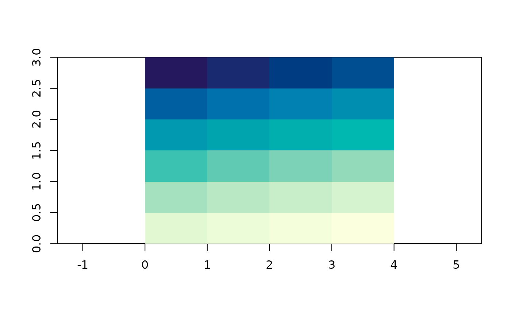

# What a grid is

Every interpolation in this package produces a grid, and a grid here is
a list of four things. There is no fifth thing and no class hierarchy to
learn.

``` r

library(guerrilla)
g <- grid_spec(dimension = c(8, 6), extent = c(0, 4, 0, 3))
str(unclass(g))
#> List of 4
#>  $ dimension: int [1:2] 8 6
#>  $ extent   : num [1:4] 0 4 0 3
#>  $ crs      : NULL
#>  $ values   : NULL
```

`dimension` is how many cells across and down, in that order. `extent`
is the outer boundary as `xmin, xmax, ymin, ymax`. `crs` is what the
coordinates mean, or `NULL` when nobody said. `values` is one number per
cell, filled in later by whatever produced it.

That is genuinely all a raster is. Every raster class in R holds these
same few numbers plus a vector, and the rest is convenience. Keeping
them in a plain list means the interpolation code can be read without
knowing anything about raster classes, which is the point of the
package.

## Where the cells are

Cell size is not stored, because it is `extent` divided by `dimension`
and storing it too would let the two disagree:

``` r

grid_res(g)
#> [1] 0.5 0.5
grid_ncell(g)
#> [1] 48
```

Cell centres come from
[`grid_xy()`](https://hypertidy.github.io/guerrilla/reference/grid_xy.md).
That one function is everything the interpolation code needs to know
about grids:

``` r

head(grid_xy(g))
#>      [,1] [,2]
#> [1,] 0.25 2.75
#> [2,] 0.75 2.75
#> [3,] 1.25 2.75
#> [4,] 1.75 2.75
#> [5,] 2.25 2.75
#> [6,] 2.75 2.75
```

Cells run left to right along the top row first, then down. That is the
raster convention everywhere, and it is why every conversion in this
package and every comparison with another package involves a
[`rev()`](https://rdrr.io/r/base/rev.html) somewhere.

``` r

plot(g_filled <- local({ g$values <- seq_len(grid_ncell(g)); g }))
```



The first cell is the top left one and holds 1.

All of the arithmetic comes from , which does grid index work in base R
with no dependencies at all:

``` r

vaster::cell_from_xy(g$dimension, g$extent, cbind(0.5, 2.8))
#> [1] 2
vaster::xy_from_cell(g$dimension, g$extent, 1)
#>      [,1] [,2]
#> [1,] 0.25 2.75
```

## Making one

[`grid_spec()`](https://hypertidy.github.io/guerrilla/reference/grid_spec.md)
takes points and covers them:

``` r

set.seed(1)
xy <- cbind(runif(50), runif(50))
grid_spec(xy)
#> <guerrilla grid>
#> dimension : 60, 50  (ncol, nrow) = 3000 cells
#> extent    : 0.01339033, 0.99190609, 0.05893438, 0.96061800  (xmin, xmax, ymin, ymax)
#> resolution: 0.01630860, 0.01803367
#> crs       : <none>
#> values    : <none>
```

The extent is exactly the range of the points, so the outermost samples
sit on the boundary. Often you want a margin, and `pad` is a proportion
of the span:

``` r

grid_spec(xy, pad = 0.1)
#> <guerrilla grid>
#> dimension : 60, 50  (ncol, nrow) = 3000 cells
#> extent    : -0.08446124, 1.08975767, -0.03123398, 1.05078636  (xmin, xmax, ymin, ymax)
#> resolution: 0.01957032, 0.02164041
#> crs       : <none>
#> values    : <none>
```

`dimension` and `extent` can be given directly, and either can come from
somewhere else entirely.
[`as_grid()`](https://hypertidy.github.io/guerrilla/reference/as_grid.md)
reads a `RasterLayer` or a `SpatRaster`, so a target grid from another
package works as-is:

``` r

if (requireNamespace("terra", quietly = TRUE)) {
  as_grid(terra::rast(nrows = 10, ncols = 20, xmin = 0, xmax = 2))
}
#> <guerrilla grid>
#> dimension : 20, 10  (ncol, nrow) = 200 cells
#> extent    : 0, 2, -90, 90  (xmin, xmax, ymin, ymax)
#> resolution: 0.1, 18.0
#> crs       : GEOGCRS["WGS 84 (CRS84)",
#>     DATUM["World Geodetic System 1984",
#>         ELLIPSOID["WGS 84",6378137,298.257223563,
#>             LENGTHUNIT["metre",1]]],
#>     PRIMEM["Greenwich",0,
#>         ANGLEUNIT["degree",0.0174532925199433]],
#>     CS[ellipsoidal,2],
#>         AXIS["geodetic longitude (Lon)",east,
#>             ORDER[1],
#>             ANGLEUNIT["degree",0.0174532925199433]],
#>         AXIS["geodetic latitude (Lat)",north,
#>             ORDER[2],
#>             ANGLEUNIT["degree",0.0174532925199433]],
#>     USAGE[
#>         SCOPE["unknown"],
#>         AREA["World"],
#>         BBOX[-90,-180,90,180]],
#>     ID["OGC","CRS84"]]
#> values    : <none>
```

## Handing it to something else

The converters exist because other packages do things this one does not,
and each is a handful of lines because there is nothing to translate:

``` r

g$values <- runif(grid_ncell(g))

if (requireNamespace("raster", quietly = TRUE)) as_raster(g)
#> class      : RasterLayer 
#> dimensions : 6, 8, 48  (nrow, ncol, ncell)
#> resolution : 0.5, 0.5  (x, y)
#> extent     : 0, 4, 0, 3  (xmin, xmax, ymin, ymax)
#> crs        : NA 
#> source     : memory
#> names      : layer 
#> values     : 0.01307758, 0.9926841  (min, max)
```

``` r

if (requireNamespace("terra", quietly = TRUE)) as_terra(g)
#> class       : SpatRaster
#> size        : 6, 8, 1  (nrow, ncol, nlyr)
#> resolution  : 0.5, 0.5  (x, y)
#> extent      : 0, 4, 0, 3  (xmin, xmax, ymin, ymax)
#> coord. ref. : 
#> source(s)   : memory
#> name        :    lyr.1
#> min value   : 0.013078
#> max value   : 0.992684
```

[`as_gdalraster()`](https://hypertidy.github.io/guerrilla/reference/converters.md)
has to write a file, because that is how GDAL works. It hands back the
open dataset, which you close when you are done with it:

``` r

if (requireNamespace("gdalraster", quietly = TRUE)) {
  ds <- as_gdalraster(g, tempfile(fileext = ".tif"))
  print(ds$dim())
  print(ds$getGeoTransform())
  ds$close()
}
#> [1] 8 6 1
#> [1]  0.0  0.5  0.0  3.0  0.0 -0.5
```

Note the geotransform: GDAL puts the origin at the top left with a
negative y step, which is the same top-down row order the grid uses,
spelled differently.

[`as.matrix()`](https://rdrr.io/r/base/matrix.html) and
[`as.data.frame()`](https://rdrr.io/r/base/as.data.frame.html) are there
for the cases where you just want the numbers:

``` r

dim(as.matrix(g))
#> [1] 6 8
head(as.data.frame(g), 3)
#>      x    y     value
#> 1 0.25 2.75 0.6547239
#> 2 0.75 2.75 0.3531973
#> 3 1.25 2.75 0.2702601
```

## What is not here

A grid has no time dimension, no bands, no attributes, no units and no
resampling. Those are all real and useful things and they are what , and
are for. This package stops at the point where you would need one of
them, and hands you the numbers.
