# Interpolating irregular data

This is the tour: eight ways to turn scattered measurements into a full
grid, on one set of points, with one grid, so the pictures can be put
side by side.

Three other articles go deeper on one thing each.
[`vignette("grids")`](https://hypertidy.github.io/guerrilla/articles/grids.md)
is what a grid is and how to hand one to another package.
[`vignette("triangulation")`](https://hypertidy.github.io/guerrilla/articles/triangulation.md)
is the Delaunay and Voronoi tessellations and the arithmetic behind
them.
[`vignette("projection")`](https://hypertidy.github.io/guerrilla/articles/projection.md)
is what changes when the coordinates change, and how this all lines up
with GDAL.

## Setup

``` r

library(guerrilla)
library(palr)
```

Everything else is loaded where it is used, so it is visible which
method needs which package.

Read the zooplankton data.

``` r

library(readxl)
bw <- read_excel(system.file("extdata", "BW-Zooplankton_env.xls", package= "guerrilla", mustWork = TRUE))
summary(bw[,1:10])
#>     Station            Lat              Lon            depth     
#>  Min.   :  4.00   Min.   :-69.11   Min.   :29.98   Min.   : 175  
#>  1st Qu.: 37.25   1st Qu.:-66.84   1st Qu.:40.00   1st Qu.:1523  
#>  Median : 60.00   Median :-65.84   Median :55.06   Median :3065  
#>  Mean   : 64.36   Mean   :-65.46   Mean   :54.60   Mean   :2791  
#>  3rd Qu.:100.25   3rd Qu.:-64.09   3rd Qu.:70.00   3rd Qu.:4114  
#>  Max.   :122.00   Max.   :-61.66   Max.   :80.02   Max.   :5075  
#>       temp              sal         chl a mg/m2)       ASC (km)      
#>  Min.   :-1.6712   Min.   :33.93   Min.   : 29.60   Min.   :-39.600  
#>  1st Qu.:-1.4726   1st Qu.:34.14   1st Qu.: 44.91   1st Qu.:  4.125  
#>  Median :-1.1332   Median :34.25   Median : 53.00   Median :114.950  
#>  Mean   :-0.6755   Mean   :34.22   Mean   : 76.80   Mean   :187.506  
#>  3rd Qu.: 0.1435   3rd Qu.:34.31   3rd Qu.: 85.57   3rd Qu.:330.550  
#>  Max.   : 0.8815   Max.   :34.42   Max.   :352.51   Max.   :775.500  
#>  ice free days     Total abundance   
#>  Min.   :-35.322   Min.   :   459.3  
#>  1st Qu.:  6.108   1st Qu.:  4425.9  
#>  Median : 33.153   Median : 11346.1  
#>  Mean   : 33.139   Mean   : 23609.3  
#>  3rd Qu.: 62.901   3rd Qu.: 27417.3  
#>  Max.   :101.420   Max.   :116715.8
lonlat <- as.matrix(bw[, c("Lon", "Lat")])
val <- bw$temp
```

The values are sea surface temperatures, so the plots use a palette
meant for them, from :

``` r

cols <- sst_pal(24)
```

Plot the temperature data.

``` r

plot(val)
```


Create a grid to interpolate onto. The same grid is used for every
method below, so the pictures can be compared.

``` r

r0 <- grid_spec(lonlat, crs = "EPSG:4326")
r0
#> <guerrilla grid>
#> dimension : 60, 50  (ncol, nrow) = 3000 cells
#> extent    : 29.98, 80.02, -69.11, -61.66  (xmin, xmax, ymin, ymax)
#> resolution: 0.834, 0.149
#> crs       : EPSG:4326
#> values    : <none>
```

A grid here is a list of four things and nothing else, and cell centres
come from
[`grid_xy()`](https://hypertidy.github.io/guerrilla/reference/grid_xy.md).
That is all the interpolation code below knows about grids;
[`vignette("grids")`](https://hypertidy.github.io/guerrilla/articles/grids.md)
is the whole story if you want it.

``` r

str(unclass(r0))
#> List of 4
#>  $ dimension: int [1:2] 60 50
#>  $ extent   : num [1:4] 30 80 -69.1 -61.7
#>  $ crs      : chr "EPSG:4326"
#>  $ values   : NULL
head(grid_xy(r0), 3)
#>        [,1]     [,2]
#> [1,] 30.397 -61.7345
#> [2,] 31.231 -61.7345
#> [3,] 32.065 -61.7345
```

## Binning

The simplest thing possible is to define a grid and drop the points into
it.

``` r

bingrid <- grid_bin(lonlat, val, r0)
plot(bingrid, col = cols)
points(lonlat, pch = 16, cex = 0.3)
```

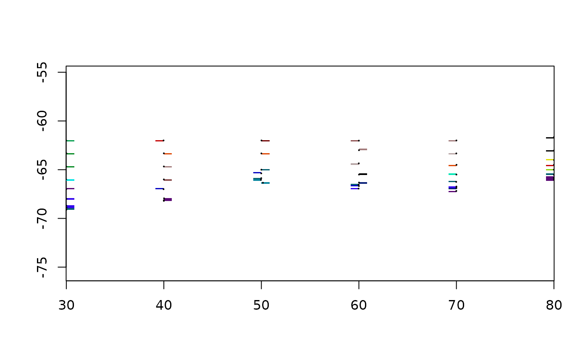

Nothing is estimated between the points: a cell with no point in it
stays `NA`, which is most of them. The whole of
[`grid_bin()`](https://hypertidy.github.io/guerrilla/reference/grid_bin.md)
is
[`vaster::cell_from_xy()`](https://hypertidy.github.io/vaster/reference/cells.html)
and [`tapply()`](https://rdrr.io/r/base/tapply.html), and it is worth
having because of the question it forces, which every other method on
this page answers without telling you.

### What happens when two points land in one cell

`fun` is that answer, written down.

``` r

counts <- grid_bin(lonlat, val, r0, fun = length)
plot(counts)
```

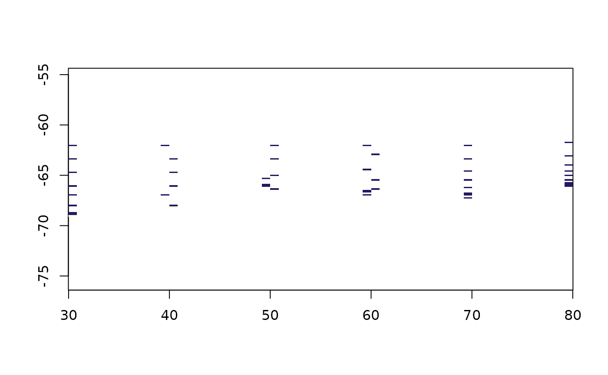

``` r

range(counts$values, na.rm = TRUE)
#> [1] 1 2
```

The transect was sampled along a line, so cells on the line hold several
measurements and cells off it hold none. `fun = mean` averages them,
`fun = length` counts them, `fun = function(x) x[1]` keeps whichever
came first in the file. The last one is what a lot of software does by
default.

That count grid is the most useful picture in this vignette. Every
surface below fills the whole extent, and every one of them is inventing
the parts of it where this grid is `NA`.

``` r

plot(grid_bin(lonlat, val, grid_spec(lonlat, dimension = c(15, 12))))
points(lonlat, pch = 16, cex = 0.3)
```

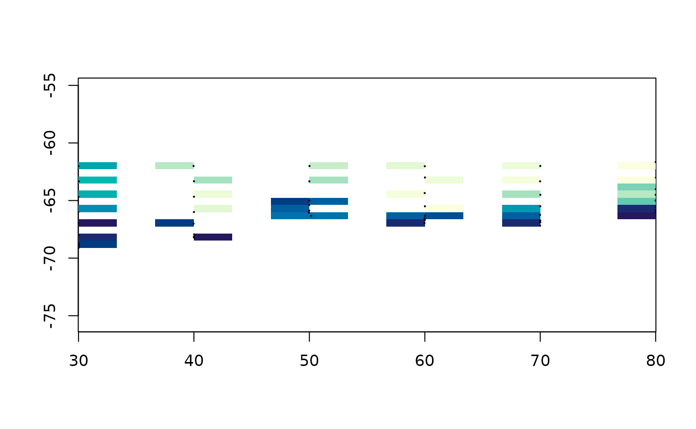

Coarser cells fill more of the grid and say less about any of it. There
is no resolution that fixes this, which is the reason to interpolate.

## Thin plate splines

The surface that passes near the data while bending as little as
possible. This is the engine behind GDAL’s `-tps` warping, so it is also
what happens when you georeference an image from ground control points.

``` r

tpsgrid <- grid_tps(lonlat, val, r0)
#> Warning: 
#> Grid searches over lambda (nugget and sill variances) with  minima at the endpoints: 
#>   (GCV) Generalized Cross-Validation 
#>    minimum at  right endpoint  lambda  =  3.169597e-06 (eff. df= 47.50002 )
plot(tpsgrid, col = cols)
points(lonlat, pch = 16, cex = 0.3)
```


It filled the whole grid, including the corners, where there is no data
within several degrees. That is not a bug and it is not a secret either,
because the same fit will say how sure it is:

``` r

plot(grid_tps(lonlat, val, r0, statistic = "se"))
#> Warning: 
#> Grid searches over lambda (nugget and sill variances) with  minima at the endpoints: 
#>   (GCV) Generalized Cross-Validation 
#>    minimum at  right endpoint  lambda  =  3.169597e-06 (eff. df= 47.50002 )
points(lonlat, pch = 16, cex = 0.3)
```

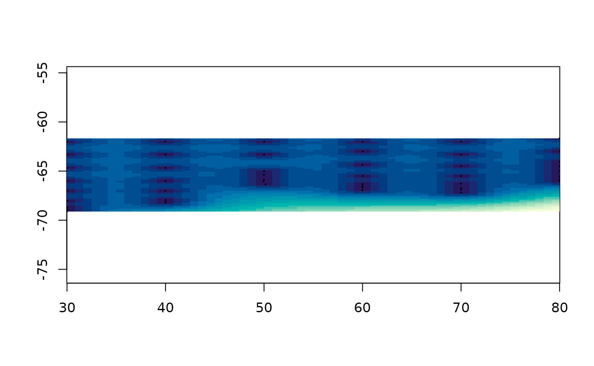

The two pictures belong together. The first says what the method thinks
and the second says where it is guessing, and the second one looks a
great deal like the count grid from the previous section.

Read the warning rather than ignoring it. `fields` searched for a
smoothing parameter, found the minimum at the end of its range, and
reports 47.5 effective degrees of freedom for 50 data points. That is a
spline passing through the data rather than smoothing it: with fifty
points along one transect there is nothing to average over, so cross
validation says do not average. `method = "REML"` picks the smoothing
parameter a different way and is worth comparing.

``` r

plot(grid_tps(lonlat, val, r0, method = "REML"), col = cols)
```

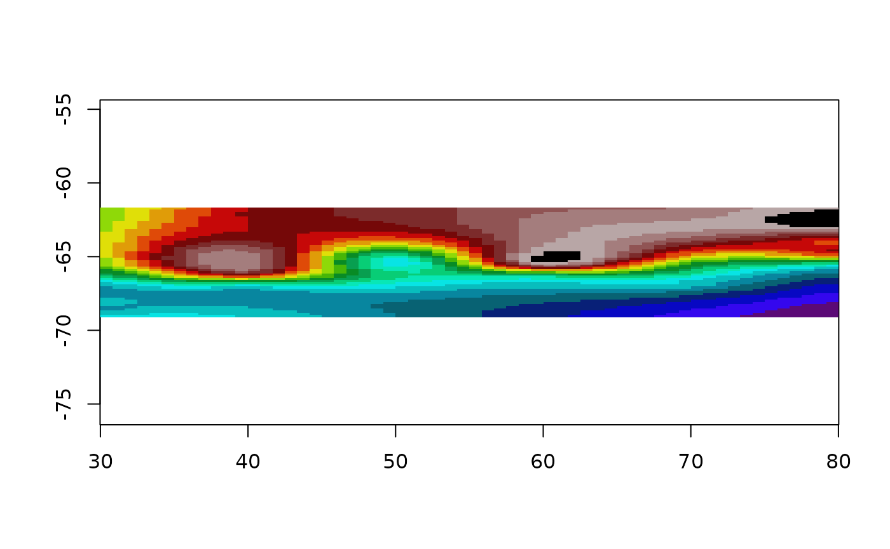

`lon.lat` is the one place in this package where what the coordinates
mean changes the arithmetic: a spline bends in the plane of its
coordinates, and a degree of longitude is not a degree of latitude
anywhere but the equator. It is not read off the `crs`, because the
guess would be wrong exactly when it mattered.

``` r

lltps <- grid_tps(lonlat, val, r0, lon.lat = TRUE)
#> Warning: 
#> Grid searches over lambda (nugget and sill variances) with  minima at the endpoints: 
#>   (GCV) Generalized Cross-Validation 
#>    minimum at  right endpoint  lambda  =  0.01518704 (eff. df= 47.49805 )
plot(lltps, col = cols)
```

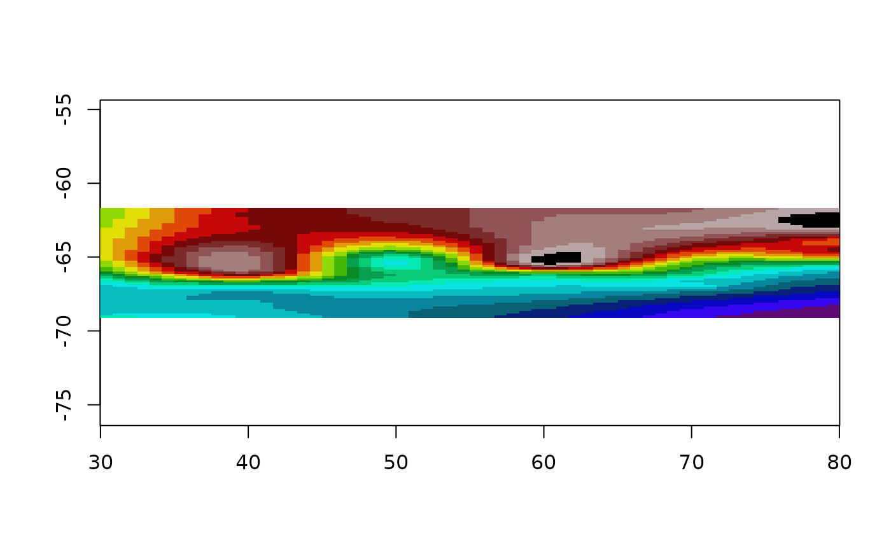

## Bilinear triangulation

Triangulate the points, and inside each triangle put the plane through
its three corner values. This is what MATLAB calls
`griddata(method = "linear")` and GDAL calls `gdal_grid -a linear`.

``` r

trigrid <- grid_barycentric(lonlat, val, r0)
plot(trigrid)
points(lonlat, pch = 16, cex = 0.3)
```

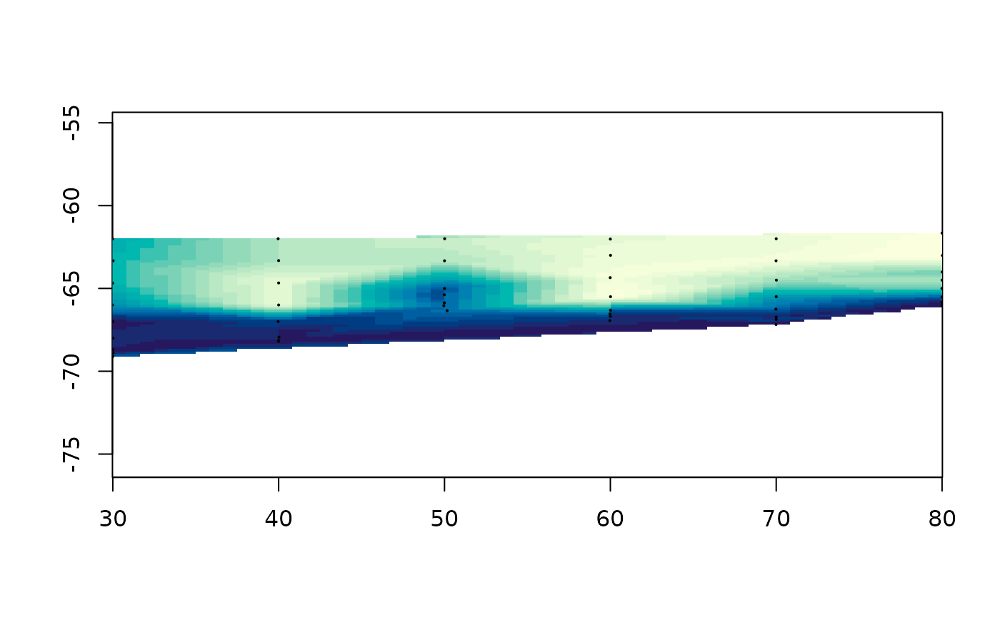

It passes exactly through the data and invents nothing beyond it, so
cells outside the convex hull stay `NA`. That is the honest end of the
range: no answer where there is no basis for one.

The arithmetic is barycentric coordinates, which are three numbers that
are both the point-in-triangle test and the interpolation rule at once:

``` r

bary_weights(cbind(c(0, 1, 0), c(0, 0, 1)),
             rbind(c(0.25, 0.25), c(1/3, 1/3), c(1, 1)))
#>            [,1]      [,2]      [,3]
#> [1,]  0.5000000 0.2500000 0.2500000
#> [2,]  0.3333333 0.3333333 0.3333333
#> [3,] -1.0000000 1.0000000 1.0000000
```

The third point is outside the triangle, which shows as a negative
weight rather than as a separate test.
[`vignette("triangulation")`](https://hypertidy.github.io/guerrilla/articles/triangulation.md)
goes through this properly, along with the Delaunay and Voronoi
tessellations, the readable R engine, and what the old
[`facets()`](https://hypertidy.github.io/guerrilla/reference/facets.md)
was really computing.

## Nearest neighbour

``` r

vor <- grid_voronoi(lonlat, val, r0)
plot(vor)
```


A Voronoi tile is everywhere closer to its own point than to any other,
so filling each tile with its point’s value is nearest neighbour drawn
rather than computed. Note that it filled the whole grid where
triangulation left the corners `NA`. Tiles cover the plane, so nothing
is ever outside them, and a cell far from any data still gets a
confident answer.

## Inverse distance weighting

A weighted average of the input values, weighted by one over distance to
a power. There is no model here, only a rule.

``` r

op <- par(mfrow = c(2, 1), mar = c(2, 2, 2, 1))
plot(grid_idw(lonlat, val, r0, idp = 0.5), main = "idp = 0.5")
plot(grid_idw(lonlat, val, r0, idp = 8), main = "idp = 8")
```

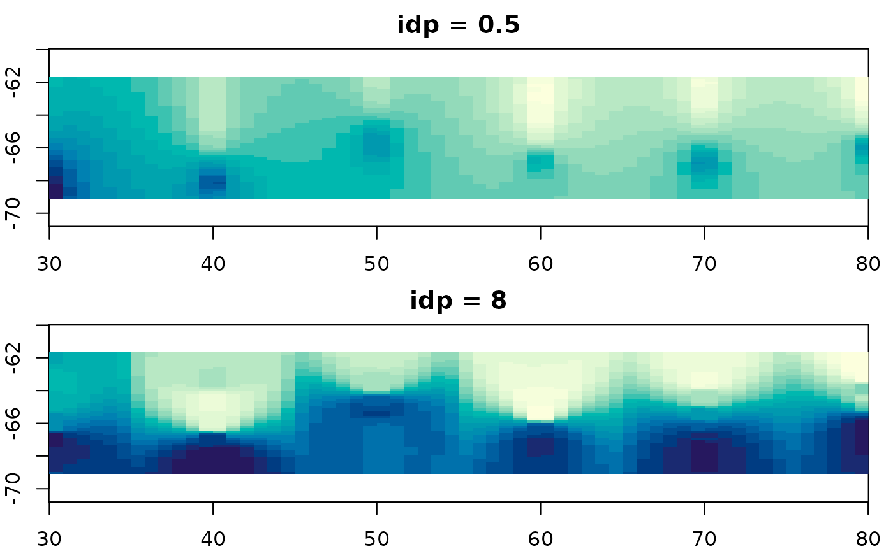

``` r

par(op)
```

`idp` is the whole method. Raise it and the nearest point dominates, so
the surface tends towards
[`grid_voronoi()`](https://hypertidy.github.io/guerrilla/reference/grid_voronoi.md);
lower it and everything flattens towards the overall mean. Neither end
is more correct than the other and nothing in the data tells you where
to sit between them, which is why the default of 2 is a convention
rather than an answer.

The consequence is that this method cannot report a standard error. It
never claimed to be estimating anything, so there is nothing to be
uncertain with.

## Kriging

The same idea taken seriously. The variogram is a picture of how much
two values differ as a function of how far apart they are; kriging fits
a curve to that picture and uses the curve to choose the weights.

``` r

krigrid <- grid_kriging(lonlat, val, r0)
plot(krigrid, col = cols)
```

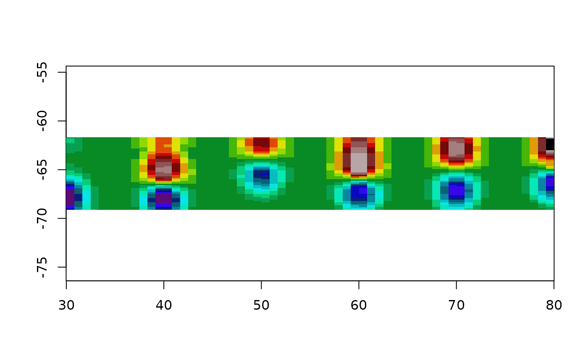

Because the weights come from a fitted model, there is a variance to go
with them:

``` r

plot(grid_kriging(lonlat, val, r0, statistic = "se"))
points(lonlat, pch = 16, cex = 0.3)
```

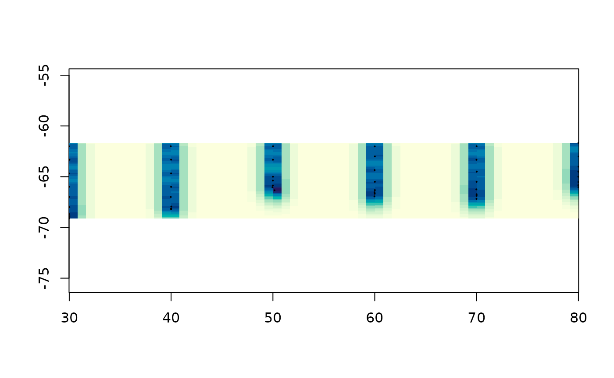

That surface is usually more informative than the prediction, and it is
the reason to reach for this method rather than IDW.

It is also the only method here that can refuse. Give it values with no
spatial structure and there is no curve to fit, the fit comes back with
a negative range, and it stops:

``` r

set.seed(9)
noise <- cbind(runif(120), runif(120))
grid_kriging(noise, rnorm(120))
#> Warning in gstat::fit.variogram(vg, model): singular model in variogram fit
#> Error:
#> ! the variogram fit returned a model that cannot be used: a negative range or sill.
#>   Usually that means these values have no spatial structure at these distances,
#>   so there is nothing for kriging to weight by. Look at
#>     gstat::variogram(value ~ 1, ~ x + y, data)
#>   and pass a starting 'model' from gstat::vgm() if you can see structure in it.
```

Every other method on this page will interpolate pure noise without
complaint and hand you a picture of it.

## Generalized additive models

``` r

plot(grid_gam(lonlat, val, r0), col = cols)
```

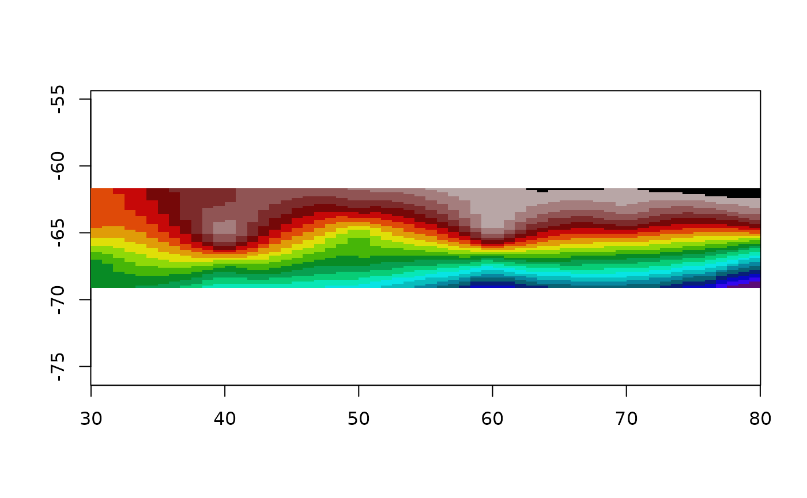

The default formula is `value ~ s(x, y)`, one isotropic two dimensional
smooth. `mgcv`’s default basis for a two dimensional `s()` is a thin
plate regression spline, so this is the thin plate spline from earlier
with fewer basis functions and the smoothing parameter chosen by REML.
On this data the two are hard to tell apart, which is the point.

The wrong model is instructive too:

``` r

op <- par(mfrow = c(2, 1), mar = c(2, 2, 2, 1))
plot(grid_gam(lonlat, val, r0), main = "s(x, y)")
plot(grid_gam(lonlat, val, r0, formula = value ~ s(x) + s(y)),
     main = "s(x) + s(y)")
```

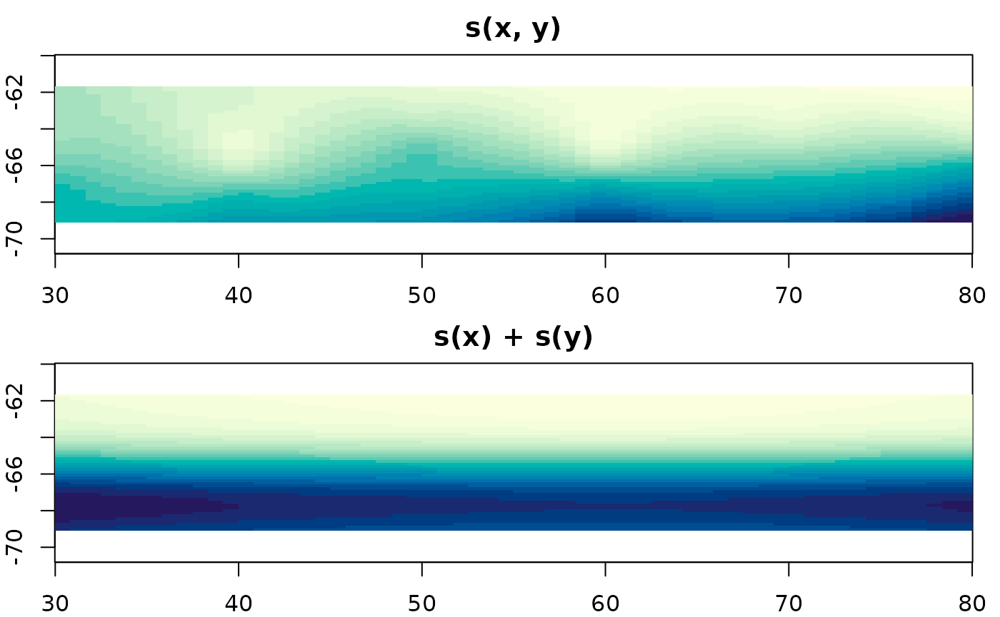

``` r

par(op)
```

Additive in x and y means every column of the grid has the same shape as
every other column, up to a shift. It cannot represent a feature that
sits in one place, so it smears anything local into a cross.

## Kernel smoothing

Bin first, estimate second.

``` r

plot(grid_smooth(lonlat, val, r0, theta = 1), col = cols)
```

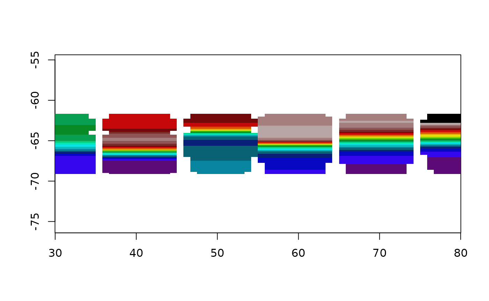

Everything else here works from the points; this one goes through a grid
on the way. The binning throws away where inside its cell each point
was, and no amount of smoothing afterwards gets that back. `theta` is
the kernel bandwidth, in the units of the coordinates, and it does all
the work.

## Akima (via the interp package)

`interp(method = "linear")` triangulates and interpolates linearly
within each triangle, which is the same thing
[`grid_barycentric()`](https://hypertidy.github.io/guerrilla/reference/grid_barycentric.md)
does. Worth checking that claim rather than believing it: on this data
the two agree to within 1e-15.

``` r

library(interp)
akifun <- function(xy, value, grid = NULL, ...) {
  if (is.null(grid)) grid <- grid_spec(xy)
  dm <- grid$dimension; ex <- grid$extent
  ## interp() wants both output axes increasing, and grid rows run top-down.
  ## Hand it a descending yo and it returns all NA, without complaint.
  aklin <- interp(xy[,1], xy[,2], value,
                  vaster::x_from_col(dm, ex, seq_len(dm[1])),
                  rev(vaster::y_from_row(dm, ex, seq_len(dm[2]))), ...)
  grid$values <- as.vector(aklin$z[, rev(seq_len(ncol(aklin$z)))])
  grid
}

akigrid <- akifun(lonlat, val, grid = r0)
plot(akigrid)
```


``` r


## the same estimator as grid_barycentric(), so it had better agree
ok <- !is.na(akigrid$values) & !is.na(trigrid$values)
max(abs(akigrid$values[ok] - trigrid$values[ok]))
#> [1] 2.620126e-14
```

## What the pictures have in common

Eight methods, one grid, one set of points.

``` r

op <- par(mfrow = c(4, 2), mar = c(2, 2, 2, 1))
plot(bingrid, main = "grid_bin")
plot(vor, main = "grid_voronoi")
plot(trigrid, main = "grid_barycentric")
plot(akigrid, main = "interp::interp")
plot(tpsgrid, main = "grid_tps")
plot(krigrid, main = "grid_kriging")
plot(grid_idw(lonlat, val, r0), main = "grid_idw")
plot(grid_gam(lonlat, val, r0), main = "grid_gam")
```

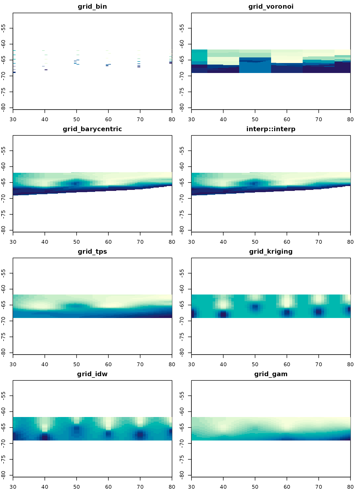

``` r

par(op)
```

They disagree most where there is no data, and that is the only place
the choice between them matters much. Near the transect they all say
roughly what the measurements say, because there is nothing else for
them to say.

Two of them fill only the convex hull and leave the rest `NA`. Four fill
the whole extent from a fitted model, and three of those will tell you
how sure they are if asked. One fills the whole extent from a rule and
cannot.

There is no method here that is right. There is a method that makes its
assumptions visible and a method that does not, and the difference is
worth more than the surfaces.

## Where to next

- [`vignette("grids")`](https://hypertidy.github.io/guerrilla/articles/grids.md)
  – what a grid is, and the converters to raster, terra and gdalraster.
- [`vignette("triangulation")`](https://hypertidy.github.io/guerrilla/articles/triangulation.md)
  – barycentric weights spelled out, the two tessellations drawn, and
  the readable engine that checks the fast one.
- [`vignette("projection")`](https://hypertidy.github.io/guerrilla/articles/projection.md)
  – the same data in two coordinate systems, GDAL’s own gridder, and
  thin plate splines as georeferencing.
