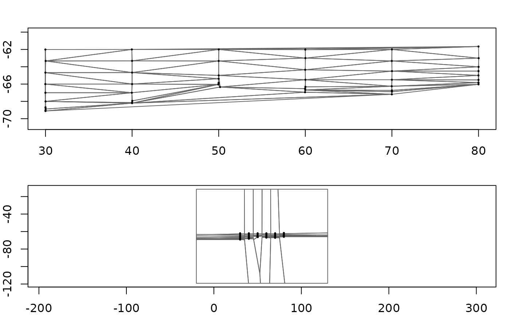
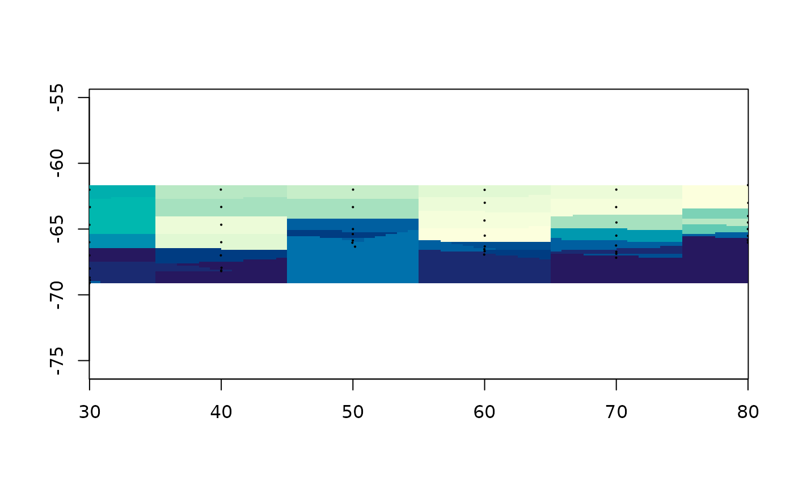

# Triangles, tiles, and the weights between them

Two of the methods in this package come from tessellating the plane
rather than fitting anything: cut the space up around the data points,
then let each piece answer for the region it covers. They give the two
simplest honest answers there are, and the arithmetic behind both fits
on one page.

``` r

library(guerrilla)
library(readxl)
bw <- read_excel(system.file("extdata", "BW-Zooplankton_env.xls",
                             package = "guerrilla", mustWork = TRUE))
lonlat <- as.matrix(bw[, c("Lon", "Lat")])
val <- bw$temp
g <- grid_spec(lonlat, crs = "EPSG:4326")
```

## The two tessellations

GEOS builds both, and they are duals of each other.

``` r

library(geos)
pts <- as_geos_geometry(wk::xy(lonlat[, 1], lonlat[, 2]))
coll <- geos_make_collection(pts)

op <- par(mfrow = c(2, 1), mar = c(2, 2, 2, 1))
plot(geos_unnest(geos_delaunay_triangles(coll), keep_multi = FALSE),
     col = NA, border = "grey40", main = "Delaunay triangles")
points(lonlat, pch = 16, cex = 0.4)
plot(geos_unnest(geos_voronoi_polygons(coll), keep_multi = FALSE),
     col = NA, border = "grey40", main = "Voronoi tiles")
points(lonlat, pch = 16, cex = 0.4)
```



``` r

par(op)
```

They answer different questions. A Delaunay triangle has three data
points at its corners, so a value inside it can be a blend of three. A
Voronoi tile has one data point in it and consists of everywhere closer
to that point than to any other, so a value inside it can only be that
one point’s value.

Which means the Voronoi tessellation *is* nearest neighbour:

``` r

plot(grid_voronoi(lonlat, val, g))
points(lonlat, pch = 16, cex = 0.3)
```



## Barycentric coordinates

The Delaunay case needs one idea. For a point inside a triangle, the
barycentric weights say how much of each corner the point is made of.
They sum to one, and they are all non-negative exactly when the point is
inside – so the same three numbers are both a point-in-triangle test and
the interpolation rule.

``` r

tri <- cbind(c(0, 1, 0), c(0, 0, 1))
bary_weights(tri, rbind(c(0.25, 0.25), c(1/3, 1/3), c(1, 1)))
#>            [,1]      [,2]      [,3]
#> [1,]  0.5000000 0.2500000 0.2500000
#> [2,]  0.3333333 0.3333333 0.3333333
#> [3,] -1.0000000 1.0000000 1.0000000
```

The first point is a quarter of the way in from two corners; the second
is the centroid, made equally of all three; the third is outside, which
shows up as a negative weight rather than as a separate test.

The whole of
[`bary_weights()`](https://hypertidy.github.io/guerrilla/reference/bary_weights.md)
is Cramer’s rule on a two by two system, six lines of arithmetic.
Reading it is a better use of ten minutes than reading any description
of it, including this one.

Interpolating is then the weighted sum of the corner values:

``` r

tri_grid <- grid_barycentric(lonlat, val, g)
plot(tri_grid)
```


Inside each triangle the surface is the plane through its three corner
values, so the result is continuous, passes exactly through the data,
and invents nothing beyond it. Cells outside the convex hull are in no
triangle and stay `NA` – unlike the Voronoi fill above, which covers
everything. That is convenient, and it is also nearest neighbour’s main
way of lying to you: a cell far from any data still gets a confident
answer.

## Two engines, one answer

[`grid_barycentric()`](https://hypertidy.github.io/guerrilla/reference/grid_barycentric.md)
normally gets its result from one call to
[`geometry::tsearch()`](https://rdrr.io/pkg/geometry/man/tsearch.html),
which finds the containing triangle for every cell and its weights in a
single pass of C. That is the right way to compute it and the wrong way
to learn it, so the same job is also written out in R:
[`find_triangle()`](https://hypertidy.github.io/guerrilla/reference/find_triangle.md)
to locate each cell,
[`bary_weights()`](https://hypertidy.github.io/guerrilla/reference/bary_weights.md)
to weight it.

``` r

slow <- grid_barycentric(lonlat, val, g, engine = "R")
ok <- !is.na(slow$values)
max(abs(slow$values[ok] - tri_grid$values[ok]))
#> [1] 6.605827e-15
```

The readable one is much slower and agrees to floating point. It is not
there for speed, it is there so the claim “this is what the C is doing”
can be checked rather than believed.

[`find_triangle()`](https://hypertidy.github.io/guerrilla/reference/find_triangle.md)
is worth a look on its own, because the search is the part people assume
is hard. It asks GEOS which triangles a point could be in, using an
STRtree index, then uses
[`bary_weights()`](https://hypertidy.github.io/guerrilla/reference/bary_weights.md)
to decide which one it actually is.

``` r

triangles <- geometry::delaunayn(lonlat)
find_triangle(lonlat, triangles, rbind(c(50, -65), c(0, 0)))
#> [1] 51 NA
```

The second point is nowhere near the data, and gets `NA`.

## The long way round, and a bug it revealed

Three points determine a plane, and least squares through exactly three
points is that plane. So fitting `value ~ x + y` inside each Delaunay
triangle must give the same surface as barycentric interpolation:

``` r

lm_grid <- grid_facet_lm(lonlat, val, g)
both <- !is.na(lm_grid$values) & !is.na(tri_grid$values)
max(abs(lm_grid$values[both] - tri_grid$values[both]))
#> [1] 5.417888e-14
```

It does, and it is enormously slower, and seeing that happen once is
worth the wait.

This package used to offer that as
[`facets()`](https://hypertidy.github.io/guerrilla/reference/facets.md),
with a Dirichlet variant alongside the Delaunay one. The Dirichlet
variant was not doing what it looked like it was doing. A Voronoi tile
holds exactly one point, so the per-tile `lm(value ~ x + y)` had one
observation and three parameters. It fitted an intercept, predicted that
single value across the whole tile, and produced – bit for bit – nearest
neighbour, computed by running a linear model per tile in an R loop.

Brute force nearest neighbour, one line, gives exactly the same numbers:

``` r

at <- grid_xy(g)
nearest <- apply(at, 1, function(p) which.min((lonlat[, 1] - p[1])^2 +
                                              (lonlat[, 2] - p[2])^2))
identical(grid_voronoi(lonlat, val, g)$values, val[nearest])
#> [1] TRUE
```

[`facets()`](https://hypertidy.github.io/guerrilla/reference/facets.md)
is still exported and still works, marked superseded. The lesson is not
that it was slow. It is that a method can be named after its machinery
rather than its answer, and then nobody notices for years what answer it
gives. Every function added in this package is named for what it
computes, because of this one.

## The same thing, from a mesh

A grid is one particular mesh: a regular one, with values at the
vertices. So turning an arbitrary mesh of triangles into a grid is
resampling one mesh onto another, and it is the same barycentric
interpolation with the triangulation step already done.

``` r

mesh <- structure(list(vb = rbind(t(cbind(lonlat, val)), 1),
                       it = t(geometry::delaunayn(lonlat)),
                       primitivetypes = "triangle"),
                  class = c("mesh3d", "shape3d"))
plot(mesh_raster(mesh, grid = g))
```


Same numbers, because it is the same triangles:

``` r

identical(mesh_raster(mesh, grid = g)$values, tri_grid$values)
#> [1] FALSE
```

[`mesh_raster()`](https://hypertidy.github.io/guerrilla/reference/mesh_raster.md)
runs the argument backwards from everything else here, which is why it
is worth having. Given points it triangulates them; given a mesh it
already has the triangles and only has to interpolate. Anything or can
hand you as a `mesh3d` can go straight onto a grid.
