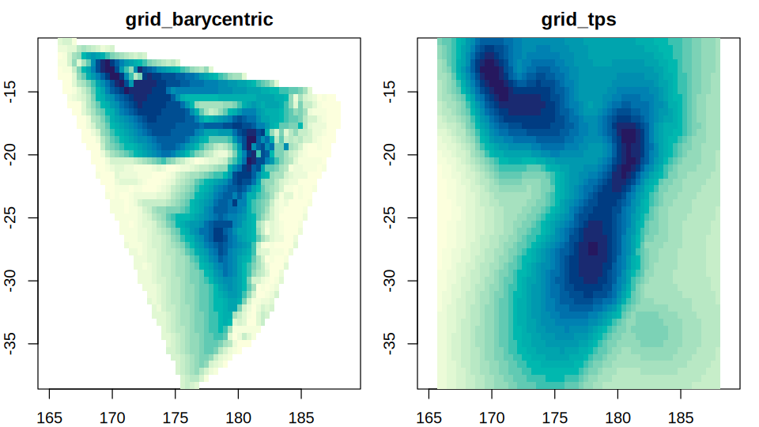
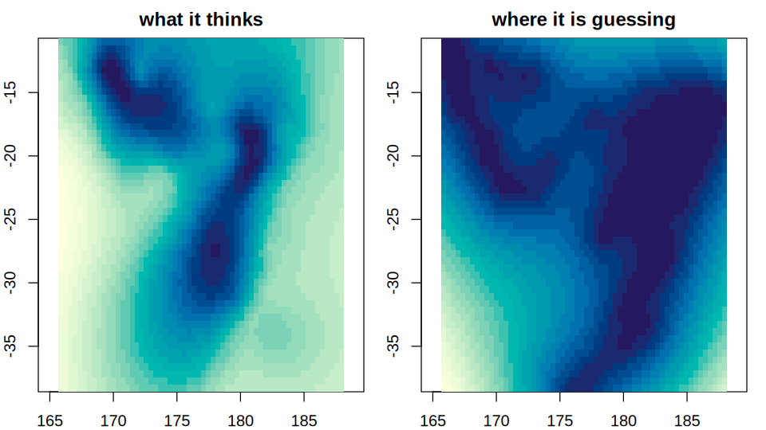

# guerrilla

You measured something in some places, and you want a picture of it
everywhere. guerrilla is a tour of the ways to do that, with the
arithmetic left visible.

``` r

library(guerrilla)

xy <- cbind(quakes$long, quakes$lat)
depth <- -quakes$depth

op <- par(mfrow = c(1, 2), mar = c(2, 2, 2, 1))
plot(grid_barycentric(xy, depth), main = "grid_barycentric")
#> 2 duplicated coordinates collapsed with mean()
plot(grid_tps(xy, depth), main = "grid_tps")
```



``` r

par(op)
```

Every method takes the same three things – coordinates, values, and a
grid to fill – and gives back a grid. The grid is a list of four
elements and nothing else:

``` r

str(unclass(grid_spec(xy)))
#> List of 4
#>  $ dimension: int [1:2] 60 50
#>  $ extent   : num [1:4] 165.7 188.1 -38.6 -10.7
#>  $ crs      : NULL
#>  $ values   : NULL
```

## What is here

[`grid_bin()`](https://hypertidy.github.io/guerrilla/reference/grid_bin.md),
[`grid_voronoi()`](https://hypertidy.github.io/guerrilla/reference/grid_voronoi.md),
[`grid_barycentric()`](https://hypertidy.github.io/guerrilla/reference/grid_barycentric.md),
[`grid_idw()`](https://hypertidy.github.io/guerrilla/reference/grid_idw.md),
[`grid_tps()`](https://hypertidy.github.io/guerrilla/reference/grid_tps.md),
[`grid_kriging()`](https://hypertidy.github.io/guerrilla/reference/grid_kriging.md),
[`grid_gam()`](https://hypertidy.github.io/guerrilla/reference/grid_gam.md),
[`grid_smooth()`](https://hypertidy.github.io/guerrilla/reference/grid_smooth.md),
and
[`grid_gdal()`](https://hypertidy.github.io/guerrilla/reference/grid_gdal.md)
for GDAL’s own gridder.
[`grid_tps()`](https://hypertidy.github.io/guerrilla/reference/grid_tps.md),
[`grid_kriging()`](https://hypertidy.github.io/guerrilla/reference/grid_kriging.md)
and
[`grid_gam()`](https://hypertidy.github.io/guerrilla/reference/grid_gam.md)
also take `statistic = "se"`, which is usually the more interesting
picture:

``` r

op <- par(mfrow = c(1, 2), mar = c(2, 2, 2, 1))
plot(grid_tps(xy, depth), main = "what it thinks")
plot(grid_tps(xy, depth, statistic = "se"), main = "where it is guessing")
```



``` r

par(op)
```

## The point of it

The goal is an easy introduction to interpolating irregular data, and to
help find a simple answer rather than to ensure you do the most rigorous
modelling possible. That part is your job.

So where a method is normally a call into compiled code, this package
also writes the arithmetic out in R next to it, and checks that the two
agree.
[`bary_weights()`](https://hypertidy.github.io/guerrilla/reference/bary_weights.md)
is barycentric coordinates in six lines;
`grid_barycentric(engine = "R")` runs the whole interpolation that way
and matches the C to floating point. On this package’s own data the
linear interpolation agrees, to floating point or exactly, across four
independent implementations: Qhull’s `tsearch()`, the R engine here,
[`interp::interp()`](https://rdrr.io/pkg/interp/man/interp.html), and
GDAL’s `gdal_grid`.

The tools should not get in the way of exploring, and not everything
**spatial** is *geo-spatial*. Nothing in the interpolation looks at a
coordinate reference system.

## Installation

``` r

# install.packages("remotes")
remotes::install_github("hypertidy/guerrilla")
```

`geometry`, `vaster`, `wk` and `geos` are required. Everything else is
suggested and needed only by the method that uses it.

## Articles

- [`vignette("interpolating")`](https://hypertidy.github.io/guerrilla/articles/interpolating.md)
  – the tour, all the methods on one dataset.
- [`vignette("grids")`](https://hypertidy.github.io/guerrilla/articles/grids.md)
  – what a grid is, and how to hand one to another package.
- [`vignette("triangulation")`](https://hypertidy.github.io/guerrilla/articles/triangulation.md)
  – barycentric weights, Delaunay and Voronoi.
- [`vignette("projection")`](https://hypertidy.github.io/guerrilla/articles/projection.md)
  – what changes when the coordinates change, and how it all lines up
  with GDAL.

## Related discussions and resources

<https://statnmap.com/2018-10-28-play-with-spatial-tools-on-3d-cells-images/>

<https://docs.qgis.org/2.8/en/docs/gentle_gis_introduction/spatial_analysis_interpolation.html>

------------------------------------------------------------------------

Please note that this project is released with a [Contributor Code of
Conduct](https://github.com/hypertidy/guerrilla/blob/master/CONDUCT.md).
By participating in this project you agree to abide by its terms.
